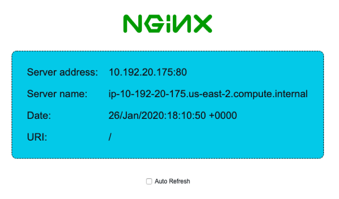
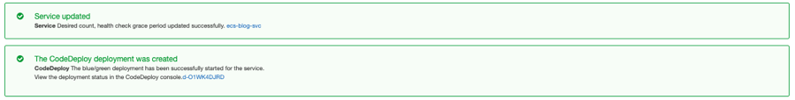

AWS CodeDeploy now supports linear and canary deployments for Amazon ECS
========================================================================

AWS CodeDeploy has extended blue/green deployment support for [Elastic
Container Service (Amazon ECS)](https://aws.amazon.com/ecs/) to include
canary and linear deployments for applications hosted on [AWS
Fargate](https://aws.amazon.com/fargate/) or [Amazon Compute Cloud
(Amazon EC2)](https://aws.amazon.com/ec2/).

Blue/green deployments are a safe deployment strategy provided by [AWS
CodeDeploy](https://aws.amazon.com/codedeploy/) for minimizing
interruptions caused by changing application versions. This is
accomplished by creating your new application environment, referred to
as green, alongside your current application that is serving your live
traffic, referred to as blue. This allows for a period of time for
monitoring and testing of the green environment before your live traffic
is routed from blue to green and subsequently turning off the blue
resources.

After the initial launch of blue/green deployments for Amazon ECS, many
customers expressed interest in having control over the amount of
traffic that was shifting over a period of time with their application
updates. Linear and canary deployments through CodeDeploy provide this
by limiting the exposure of live traffic to the new application version
to a percentage of total traffic in order to monitor performance before
routing remaining traffic with confidence. You can also set up Amazon
CloudWatch alarms and if an issue is detected CodeDeploy will
automatically reverse the traffic routing back to your original version.
CodeDeploy uses [ALB\'s Weighted Target
Group\'s](https://aws.amazon.com/blogs/aws/new-application-load-balancer-simplifies-deployment-with-weighted-target-groups/)
to make this possible.

In this post, we will show you how to configure the new linear and
canary deployments for Amazon ECS hosted on Fargate.

Here's what we will do today:

1.  Create ECS service with CodeDeploy as the controller

2.  Create a new deployment group using the new linear configuration

3.  Trigger a CodeDeploy blue/green deployment using a preset linear
    deployment configuration for routing 10 percent of traffic every one
    minute.

The following pre-defined linear and canary deployment configurations
are available as of today. You can also create custom defined linear and
canary deployments starting today as well.

<table border="0" cellspacing="5" cellpadding="2">
<tr>
<th style="vertical-align: top"><b>Deployment Configuration</b></th><th><b>Description</b></th>
</tr>
<tr>
<td style="vertical-align: top"><b>CodeDeployDefault.ECSCanary10Percent5Minutes</b></td><td>Shifts 10 percent of traffic in the first increment. The remaining 90 percent is deployed 5 minutes later.</td>
</tr>
<tr>
<td style="vertical-align: top"><b>CodeDeployDefault.ECSCanary10Percent15Minutes</b></td><td>Shifts 10 percent of traffic in the first increment. The remaining 90 percent is deployed 15 minutes later.</td>
</tr>
<tr>
<td style="vertical-align: top"><b>CodeDeployDefault.ECSLinear10PercentEvery1Minutes</b></td><td>Shifts 10 percent of traffic every minute until all traffic is shifted.</td>
</tr>
<tr>
<td style="vertical-align: top"><b>CodeDeployDefault.ECSLinear10PercentEvery3Minutes</b></td><td>Shifts 10 percent of traffic every three minutes until all traffic is shifted.</td>
</tr>
</table>

Let's get started.

Assumptions
-----------

-   All activities and resources referenced within this blog are to be
    executed and created within and AWS account and within the same
    Region

-   Docker is installed on your local development system. [Get Docker
    here](https://docs.docker.com/get-docker/)

-   The latest [AWS
    CLI](https://docs.aws.amazon.com/cli/latest/userguide/cli-chap-install.html)
    installed, as we will use this to push our container images to
    Amazon ECR.

Implementation
--------------

#### Step 1: Pull the GitHub repo that supports this blog

Pull the GitHub repository
at [github.com/aws-samples/aws-codedeploy-linear-canary-deployments-blog](https://github.com/aws-samples/aws-codedeploy-linear-canary-deployments-blog).
This repository contains the CloudFormation template and the example
Docker container to build for this post. The following will pull the
master branch to your machine.

```bash
git clone git@github.com:aws-samples/aws-codedeploy-linear-canary-deployments-blog.git
```

#### Step 2: Create an Amazon ECR repository

We will do a little upfront housekeeping that will allow us to create
two versions of a container to illustrate updating between versions
using a linear deployment. Create a repository using the
[create-repository](https://docs.aws.amazon.com/cli/latest/reference/ecr/create-repository.html)
command:

```bash
aws ecr create-repository --repository-name ecs-sample-app --region us-east-2
```

The output includes the URI of the repository, with the following
format:

```bash
111111111111.dkr.ecr.us-east-2.amazonaws.com/ecs-sample-app
```

####  Step 3: Build and push blue/green container images to the Amazon ECR repository

Using the pulled repo, move into the Docker directory and execute the
following commands, transposing your account id where necessary:

```bash
docker build -t ecs-sample-app .
docker tag ecs-sample-app:latest
111111111111.dkr.ecr.us-east-2.amazonaws.com/ecs-sample-app:v1
aws ecr --region us-east-2 get-login --no-include-email --registry-ids 111111111111 | bash
docker push 111111111111.dkr.ecr.us-east-2.amazonaws.com/ecs-sample-app:v1
```

You can now change branches and perform the same tasks above for a
second image version (v2). Use the following git command to check out
the v2 branch of the repo:

```bash
git fetch && git checkout v2
```

Perform the same actions as above rebuilding the local container,
tagging the container (switch v1 for v2), and push them to the
repository.

You can now observe the containers in the repository. Note the image
URIs.


#### Step 4: Creating infrastructure using Amazon CloudFormation

Launching the following CloudFormation (below diagram), we will bring up
our environment including a VPC and supporting resources. Below is a
diagram of the VPC architecture that will be deployed.


##### ***Image 1: Architecture Diagram***

Click Launch stack to proceed. The stack launches in us-east-2 (Ohio).

<table border="0" cellspacing="5" cellpadding="2">
<tr>
<td style="vertical-align: middle">VPC/Infrastructure Stack:</td>
<td style="vertical-align: middle">
<a href="https://us-east-2.console.aws.amazon.com/cloudformation/home?region=us-east-2#/stacks/quickcreate?stackName=ecs-linear-blog&templateURL=https://dsball-blog-content.s3-us-west-2.amazonaws.com/aws-codedeploy-linear-canary-deployments-blog/linear_ecs.yaml" target="_blank" rel="noopener"></a></td>
</tr>
</table>

Provide a value for the ImageUrl parameter, leave all other values
defaulted. This value corresponds to the first container image (v1) URI
from *Step 3*. Accept the defaults to proceed through next screens and
IAM acknowledgment to create stack. Once the stack is deployed
(CREATE_COMPLETE), navigate to the outputs section and gather the
outputs for reference. We will use these moving forward. The output will
look something like this:


#### Step 5: Creating an Amazon ECS service for blue/green deployments

Now that we have the underlying infrastructure, we are ready to create
an Amazon ECS service with blue/green deployment support from
CodeDeploy. We will use the CLI to create this.

Within the pulled git repo, navigate to the json\_files directory and
edit the create_service.json to replace the following values with the
corresponding values from your CloudFormation outputs.

Here is a transposed ***example version*** of this given the above
outputs:

```json
{
    "cluster": "ecs-blog-ECSCluster-1BC08Z8YA1A5X",
    "serviceName": "ecs-blog-svc",
    "taskDefinition": "arn:aws:ecs:us-east-2:111111111111:task-definition/ecs-blog-svc:1",
    "loadBalancers": [
        {
            "targetGroupArn": "arn:aws:elasticloadbalancing:us-east-2:111111111111:targetgroup/ecs-b-Targe-NP1KC1KYAEK1/01cf50be3fa1524c",
            "containerName": "ecs-blog-svc",
            "containerPort": 80
        }
    ],
    "launchType": "FARGATE",
    "schedulingStrategy": "REPLICA",
    "deploymentController": {
        "type": "CODE_DEPLOY"
    },
    "platformVersion": "LATEST",
    "networkConfiguration": {
       "awsvpcConfiguration": {
          "assignPublicIp": "ENABLED",
          "securityGroups": [ "sg-08fdb4f721268b4f0" ],
          "subnets": [ "subnet-0d348d95b7121ae37", "subnet-0075725bb118146dd" ]
       }
    },
    "desiredCount": 2
}
```

Once you have transposed your output values, execute the following from
within the json_files directory in your repository:

```bash
aws ecs create-service --cli-input-json file://create_service.json --region us-east-2
```

The output includes the ARN of the service, with the following format.

```bash
arn:aws:ecs:us-east-2:111111111111:service/ecs-blog-svc
```

#### Step 6: Create the AWS CodeDeploy Resources

Use the following steps to create your CodeDeploy application and the
CodeDeploy deployment group.

To create CodeDeploy resources

1.  Use
    the [create-application](https://docs.aws.amazon.com/cli/latest/reference/deploy/create-application.html) command
    to create a CodeDeploy application, specifying the ECS compute
    platform:

    ```bash
    aws deploy create-application --application-name ecs-blog-app --compute-platform ECS --region us-east-2
    ```

    The output includes the application ID, with the following format:

    ```json
    {
    "applicationId": "09ac62f6-a64d-4ffe-a890-207c8af7494d"
    }
    ```

2.  Use
    the [create-deployment-group](https://docs.aws.amazon.com/cli/latest/reference/deploy/create-deployment-group.html) command
    to create a CodeDeploy deployment group.

    Within the pulled git repo, navigate to the json\_file, edit the\
    code_deployment_group.json to replace the following values with the\
    corresponding values from your CloudFormation outputs.

    Here is a transposed ***example version*** of this given the above outputs:

    ```json
    {
        "applicationName": "ecs-blog-app",
        "deploymentGroupName": "ecs-blog-app-dg",
        "deploymentConfigName": "CodeDeployDefault.ECSLinear10PercentEvery1Minutes",
        "serviceRoleArn": "arn:aws:iam::111111111111:role/ecs-blog-EcsRoleForCodeDeploy-176BC3DEKYQ0E",

        "deploymentStyle": {
            "deploymentType": "BLUE_GREEN",
            "deploymentOption": "WITH_TRAFFIC_CONTROL"
        },
        "blueGreenDeploymentConfiguration": {
            "terminateBlueInstancesOnDeploymentSuccess": {
                "action": "TERMINATE",
                "terminationWaitTimeInMinutes": 5
            },
            "deploymentReadyOption": {
                "actionOnTimeout": "CONTINUE_DEPLOYMENT"
            }
        },
        "loadBalancerInfo": {
            "targetGroupPairInfoList": [{
                "targetGroups": [{
                                    "name": "ecs-b-Targe-NP1KC1KYAEK1"
                            },
                            {
                                    "name": "ecs-b-Targe-1PFVGY72CEI09"
                            }
                            ],
                "prodTrafficRoute": {
                    "listenerArns": [
                        "arn:aws:elasticloadbalancing:us-east-2:111111111111:listener/app/ecs-b-Publi-14GAO5UFNWDMZ/24e50a3e4a4b205c/8f817f85ec2fe816"
                    ]
                            },
                            "testTrafficRoute": {
                                    "listenerArns": [
                                        "arn:aws:elasticloadbalancing:us-east-2:111111111111:listener/app/ecs-b-Publi-14GAO5UFNWDMZ/24e50a3e4a4b205c/b511569563eb2261"
                                    ]
                            }
            }]
        },
        "ecsServices": [{
            "serviceName": "ecs-blog-svc",
            "clusterName": "ecs-blog-ECSCluster-1BC08Z8YA1A5X"
        }]
    }
    ```

We have now successfully setup linear deployment configurations for an
Amazon ECS service running on AWS Fargate. Time to exercise a linear
deployment. Let's look at what we've created on the Amazon ECS Service
and CodeDeploy Side.

Navigate to the ECS cluster
[console](https://us-east-2.console.aws.amazon.com/ecs/home?region=us-east-2#/clusters).
From here click on the cluster, in this case
ecs-blog-ECSCluster-11U2U784RFRG1. Observe the service we've created via
the CLI:


Navigate to the CodeDeploy applications
[console](https://us-east-2.console.aws.amazon.com/codesuite/codedeploy/applications?region=us-east-2).
Here we can observe the application and deployment group we have
created. Click on the application
[ecs-blog-app](https://us-east-2.console.aws.amazon.com/codesuite/codedeploy/applications/ecs-blog-app?region=us-east-2)
and then through to the deployment group
[ecs-blog-app-dg](https://us-east-2.console.aws.amazon.com/codesuite/codedeploy/applications/ecs-blog-app/deployment-groups/ecs-blog-app-dg?region=us-east-2).
We can observe the deployment group configuration. Note the deployment
configuration.


Let's look at the container that is running on Amazon ECS, by visiting
the ExternalURL for the Application Load Balancer. This can be copied
from the outputs in Step 4. If we navigate to that URL, we can observe
the NGINX home page with a blue information section.



Let's exercise the deployment configuration we created. In order to do
this, we need to create a revision of the Task Definition being used,
and instruct the ECS Service to use the new task set. We will do this
using the second container version (v2) URI, that we noted in *Step 3*.

#### Step 7: Update Task Definition revision using green container image

Navigate to the ECS Task Definitions
[console](https://us-east-2.console.aws.amazon.com/ecs/home?region=us-east-2#/taskDefinitions).
Here we will check the box next to the Task Definition ecs-blog-svc,
then click Create new revision button. This will bring us to the edit
screen for creating a new revision. We will navigate to the Container
Definitions section of the screen and update the container definition by
clicking on the Container Name:


This will bring us to edit container page. Simply replace the Image with
the secondary image (v2) URI from *Step 3*.


Click Update and then Create. We have created a new revision.


#### Step 8: Update ECS service to use new Task Definition revision and trigger a CodeDeploy linear deployment

Navigate to the ECS cluster
[console](https://us-east-2.console.aws.amazon.com/ecs/home?region=us-east-2#/clusters).
From here click on the cluster, in this case
ecs-blog-ECSCluster-1BC08Z8YA1A5X. Click the check box next to the
service, ecs-blog-scv, then click the Update button.


In the edit screen for the service, select the last revision (2) under
the Task Definition area.


Click Next Step through all the following steps, accepting the default
until the last wizard screen, click Update Service.



#### Step 9: Observe linear deployment

Navigate to the CodeDeploy console


Initially the deployment will create a replacement task set. You can see
the Traffic shifting process to the right, at 100% to the original task
set.


As the shifting progresses, you can observe the percentage shift.


Navigate in a separate window to the External URL of the Application
Load Balancer. Observe the change, enable the refresh, the information
box on the NGINX home will shift from blue to green.


After the shifting period is complete, the deployment will terminate the
original task set. This period of wait is configurable. In our case we
have set this to 5 minutes, the default is 60 minutes.


Conclusion
----------

In this post, I showed you how to create a Fargate ECS service with
blue/green linear deployments powered by CodeDeploy. Take this example
and attempt the other variants of linear/canary deployment
configurations, customize one for your needs as well.

For information about how to automate this end-to-end using a continuous
delivery pipeline in CodePipeline and ECR, check out this [blog post](https://aws.amazon.com/blogs/devops/build-a-continuous-delivery-pipeline-for-your-container-images-with-amazon-ecr-as-source/).

I hope that the information in this post helps you get started
implementing this for your own applications!


